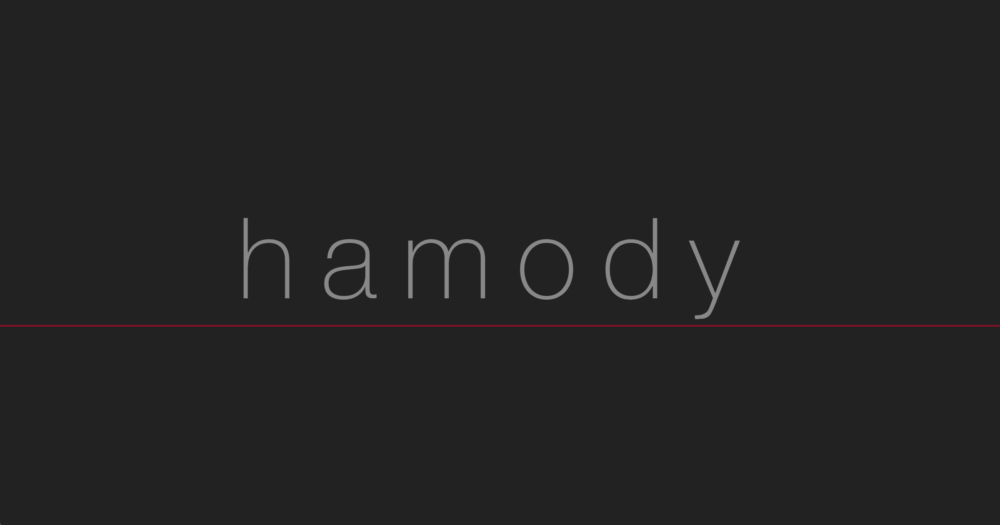
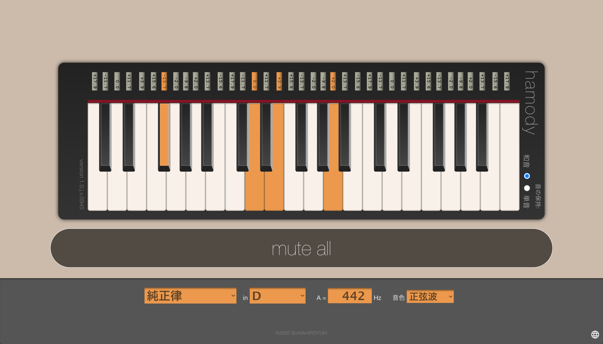

# 純正律キーボード - hamody -

**純正律キーボード - hamody - (ハモディ)** は、純正律 (Just Intonation) をはじめ、平均律や中全音律など複数の音律を切り替えて比較できるブラウザ上の鍵盤楽器です。
和音や音程の響きの違いを視覚的・聴覚的に体験でき、合唱・吹奏楽・オーケストラ・室内楽など多様な音楽活動の現場で、より良いハーモニーの追求に役立ちます。
音楽教育や耳トレーニング、作曲、指導にも最適で、日本語と英語の両言語に対応しています。

**hamody** is a browser-based keyboard instrument that allows you to switch between and compare multiple temperaments, including the just intonation, equal temperament, and meantone temperament.
It allows users to visually and aurally experience the differences in the resonance of chords and intervals, and is useful in the pursuit of better harmony in a variety of musical activities such as choral, brass band, orchestra, and chamber music.
It is also ideal for music education, ear training, composition, and teaching, and is available in both English and Japanese.

# Live Demo

https://storage.googleapis.com/hamody/index.html

# License

[MIT License](LICENSE)

# Author

&copy;2020 諏訪宏幸 / SUWA Hiroyuki  
https://github.com/hiroyuki-suwa/
